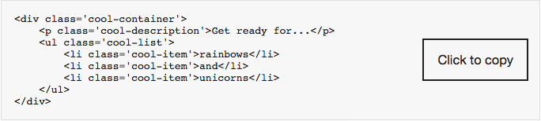

# @pickra/copy-code-block

## Why
I wanted to use [@storybook/html](https://www.npmjs.com/package/@storybook/html) to build HTML/CSS components and have the 'copy code to the clipboard' functionality from [@storybook/addon-info](https://www.npmjs.com/package/@storybook/addon-info). But this isn't [currently supported](https://github.com/storybooks/storybook/issues/4832), as of Dec, 2018.

Enter `copy-code-block`, a solution to display code in the browser and copy it to the clipboard.

## What
copy-code-block accepts HTML, or HTML in a string, and returns
a new string. The new string contains the transformed HTML and a
button that will copy the HTML to the clipboard. 


## Credit
Couldn't have done this without [kgroat](https://github.com/kgroat).

## Usage
```javascript
import copyCodeBlock from 'copy-code-block';
// OR
const copyCodeBlock = require('copy-code-block');
```
Then add it to your code
```javascript
import anHtmlFile from './anHtmlFile.html';
copyCodeBlock(anHtmlFile);
```
OR
```javascript
copyCodeBlock('<div>Thundercats</div>')
```
OR
```javascript
`${copyCodeBlock('<div>Thundercats</div>')}`
```
### If you don't like the colors, you can override them.
```javascript
import anHtmlFile from './anHtmlFile.html';
copyCodeBlock(anHtmlFile, options);
```
The options argument is an object. You can find the defaults
[here](https://github.com/Pickra/copy-code-block/blob/master/src/helpers.js#L22).

## Dev
**Requirements:** `node` 6.0.0 or higher, `npm` 3.8.6 or higher
- `npm start`, runs storybook

### Tests
- `npm start`
- in a different terminal, `npm t` runs all the tests

### To run 1 test file, prepend `-- -t tests/theTestFileName.js`
```
npm t -- -t tests/SimplHTML.js
```

### To run 1 testcase, prepend `--testcase "name of testcase"`
```
npm t -- -t tests/SimplHTML.js --testcase "Simple HTML"
```